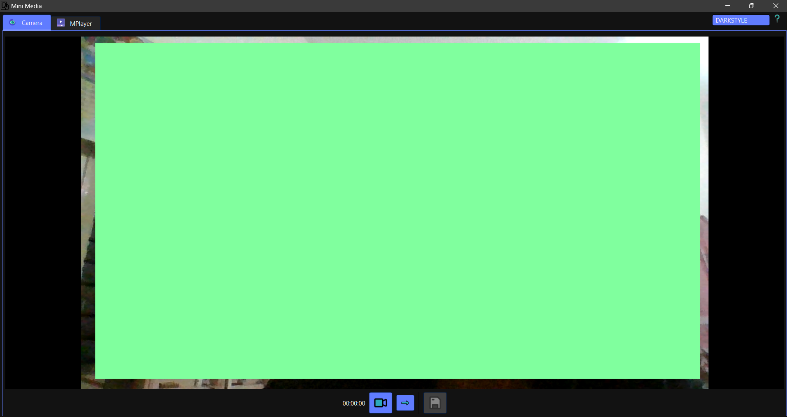
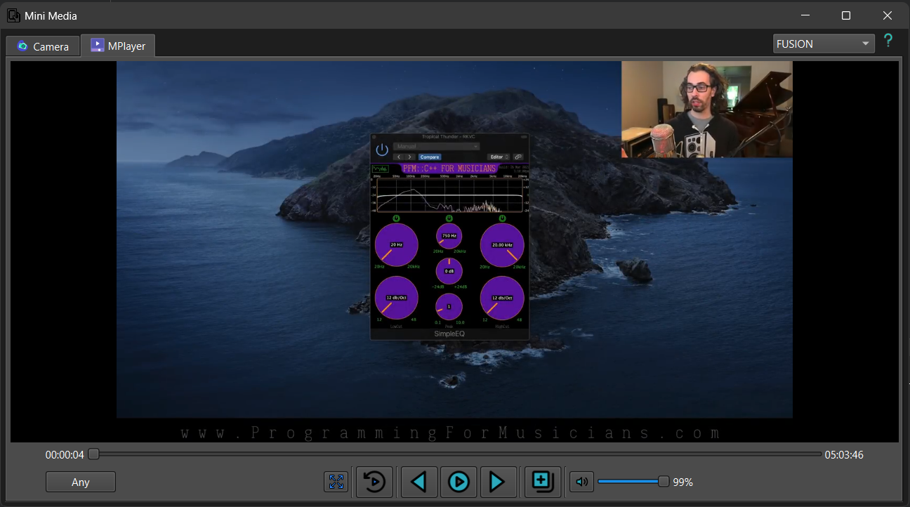
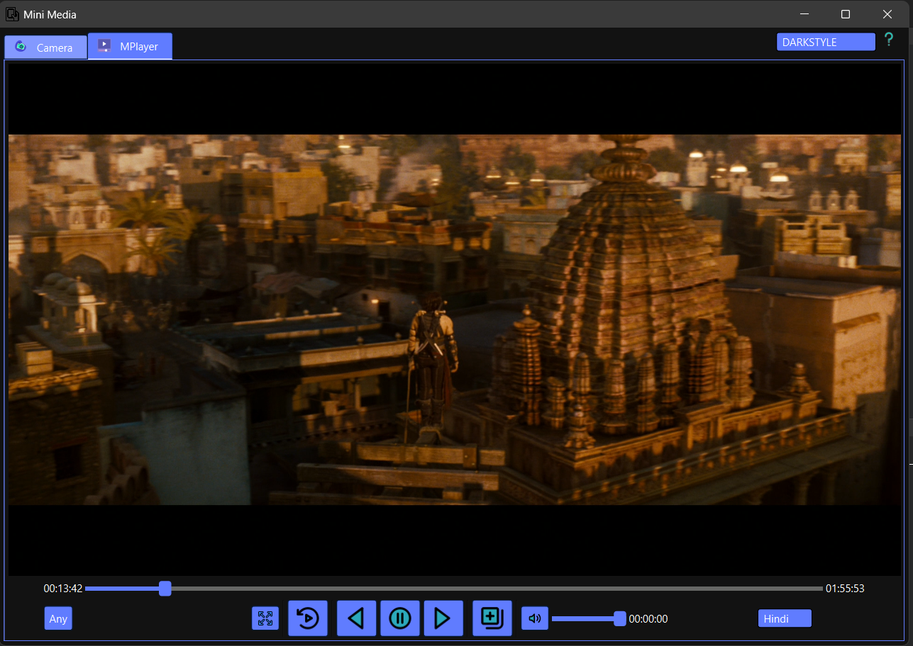

# Mini-Media

**Mini-Media** is a Qt6-based multimedia application for capturing and playback functionalities. Built using MSVC 2019 and Qt6, the application supports multiple themes, advanced playback features, and an intuitive UI for a delightful user experience.


- Feel free to Contribute
- Can be used to learn the Multimedia library as well
---

## Features

### 📸 Media Capture (Tab 1)
- **Image Capture**:  
  - Capture high-quality images using connected cameras.  
  - Preview captured images before saving.  

- **Audio/Video Recording**:  
  - Record audio or video using microphones and cameras.  
  - Save recordings in standard formats for easy playback and sharing.  


---

### 🎥 Media Playback (Tab 2)
- **Image Viewer**:  
  - Open and view images in an interactive interface.  
- **Audio/Video Player**:  
  - Play audio and video files with customizable controls.  
  - Support for changing playback language or audio tracks.  
  - Advanced playback options:  
    - **Playback Speed Adjustment**: Slow down or speed up media playback.  
    - **Seeking and Looping**: Jump to specific points or loop sections.  
    - **Volume and Balance Control**: Adjust sound levels and balance.




---

### 🎨 Themes and Customization
Mini-Media offers different Light/Dark mode themes. 

---

## Installation

### Prerequisites
Ensure you have the following installed and configured:
- **Qt6**: A cross-platform application framework (tested with MSVC 2019).  
- **MSVC 2019**: Compiler for building the application.  

### Setting Up the Environment
1. **Add Qt and MSVC to Environment Variables**:  
   Ensure the paths to Qt6 and MSVC 2019 are included in your system's environment variables.

2. **Clone the Repository**:
   ```bash
   git clone https://github.com/Mohammad-Imran01/mini-media.git
   cd mini-media
